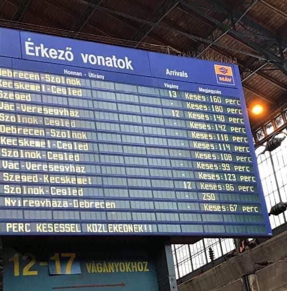

# MÁV Time Protocol - MÁV időprotokoll

## Table of contents - Tartalomjegyzék
- [MÁV Time Protocol - MÁV időprotokoll](#máv-time-protocol---máv-időprotokoll)
  - [Table of contents - Tartalomjegyzék](#table-of-contents---tartalomjegyzék)
  - [English version 🇬🇧](#english-version-)
    - [How does it work?](#how-does-it-work)
    - [How to use it?](#how-to-use-it)
    - [Disclaimer](#disclaimer)
  - [Hungarian version 🇭🇺](#hungarian-version-)
    - [Hogyan működik?](#hogyan-működik)
    - [Hogyan használd?](#hogyan-használd)
    - [Figyelmeztetés](#figyelmeztetés)

## English version 🇬🇧

Update your system time with the speed of trains! 🚂

Have you ever been to Hungary? If yes, you might have noticed that the trains are always late.

<p align="center">
    
    <br />
    <i>One such example at Nyugati Railway Station in Budapest</i>
</p>

Everyone blames MÁV for that... But what if the issue is rather a user error? In an ideal world, we should all adjust our clocks to MÁV's definition of tie. Because time is relative anyway. This way, we would never be late for anything!

Unfortunately for us though, MÁV doesn't seem to operate a publicly available [NTP](https://en.wikipedia.org/wiki/Network_Time_Protocol) server. Garrh... Even Fidesz (`c3.cap.fidesz.hu`) has one! Grow up, MÁV! It's 2025 already!

Nevertheless, it will probably arrive some*time* in the future. Until then, we have to rely on the next best thing: the unofficial MÁV Time Protocol!

### How does it work?

The idea is simple. Their webserver returns the current time in the `Date` header of the HTTP response. So the app makes a request to `https://elvira.hu/`, parses the `Date` header and serves it to you as a handcrafted NTP response.

In order to save requests and avoid accidentally DoSing their server, the app caches the time for a day. We also rely on local system time to correct the time drift. This way timing will be slightly off, but isn't that our primary goal anyway? 😏 For extra challenge, you can even mess with your server side system time and see if you can catch up to the train with 1-2 hours of surprise delay.

Stratum is set to 15 in order to indicate that the time is not reliable.

### How to use it?

You really shouldn't, but if you really want to, the easiest way is to use docker probably.

0. Make sure `docker` is installed on your system.
1. Run `docker build -t mavtp:latest .` to build the image.
2. Run `docker run --rm -d -p 123:123/udp --name mavtp mavtp:latest` to start the container.
3. Check if the server is running:
```
$ date && ntpdate -q 127.0.0.1
Sun Mar 30 02:45:54 PM CEST 2025
server 127.0.0.1, stratum 15, offset -0.201708, delay 0.02629
30 Mar 14:45:54 ntpdate[26098]: adjust time server 127.0.0.1 offset -0.201708 sec
```
4. Now you can use the server as an NTP server. For example, on Linux, you can add the following line to your `/etc/ntp.conf` file:
```
server 127.0.0.1
```
5. Restart the NTP service:
```
sudo systemctl restart ntpd
```

### Disclaimer

This is a joke project. I am not responsible for any damage caused by using this software. Use it at your own risk. The author is not affiliated with MÁV in any way. This project is not endorsed by MÁV. The author is not responsible for any legal issues that may arise from using this software. Use it at your own risk.

If you miss your train, that's also not my problem.

## Hungarian version 🇭🇺

Frissítsd a rendszeridődet a vonatok sebességével! 🚂

Jártál már Magyarországon? Ha igen, biztos észrevetted, hogy a vonatok mindig késnek.
<p align="center">
    
    <br />
    <i>Íme egy példa a Nyugati Pályaudvaron Budapesten</i>
</p>

Mindenki a MÁV-ra mutogat... De mi van, ha a probléma inkább felhasználói hiba? Egy ideális világban mindannyiunknak a MÁV idődefiníciójához kellene igazítania az óráját. Hiszen az idő relatív. Így soha nem késnénk el semmiről!

Sajnos azonban a MÁV nem tűnik úgy, hogy üzemeltetne nyilvánosan elérhető [NTP](https://en.wikipedia.org/wiki/Network_Time_Protocol) szervert. Garrh... Még a Fidesznek (`c3.cap.fidesz.hu`) is van egy! Nőj fel, MÁV! Már 2025 van!

Ennek ellenére valószínűleg el fog érkezni valamikor a jövőben. Addig is a következő legjobb dologra kell támaszkodnunk: a nem hivatalos MÁV Időprotokollra!

### Hogyan működik?

Az ötlet egyszerű. A webkiszolgálójuk visszaadja a jelenlegi időt a HTTP válasz `Date` fejlécében. Tehát az alkalmazás kérdést intéz a `https://jegy.mav.hu/` címre, elemzi a `Date` fejlécet, és kézműves NTP választ szolgáltat neked.

A kérések megtakarítása és a szerver nem szándékos DoS-olását elkerülvén az alkalmazás egy napra gyorsítótárazza az időt. A helyi rendszeridőre is támaszkodunk az időeltolódás korrekciójához. Így az idő esetlegesen még pontatlanabb lesz, de nem ez a fő célunk amúgy is? 😏 További kihívásként még meg is zavarhatod a szerveroldali rendszeridőt, és megnézheted, hogy 1-2 órás meglepetésekkel is képes vagy-e felzárkózni a vonathoz.

A stratum értéke 15-re van állítva, ezzel jelezvén, hogy a szerver által szolgáltatott idő nem megbízható.

### Hogyan használd?

Leginkább ne tedd, de ha mégis szeretnéd, akkor a legegyszerűbb módja valószínűleg a docker használata.

0. Győződj meg róla, hogy a `docker` telepítve van a rendszereden.
1. Futtasd a `docker build -t mavtp:latest .` parancsot a képfájl létrehozásához.
2. Futtasd a `docker run --rm -d -p 123:123/udp --name mavtp mavtp:latest` parancsot a konténer indításához.
3. Ellenőrizd, hogy fut-e a szerver:
```
$ date && ntpdate -q 127.0.0.1
Sun Mar 30 02:45:54 PM CEST 2025
server 127.0.0.1, stratum 15, offset -0.201708, delay 0.02629
30 Mar 14:45:54 ntpdate[26098]: adjust time server 127.0.0.1 offset -0.201708 sec
```
1. Most már használhatod a szervert NTP szerverként. Például Linuxon hozzáadhatod a következő sort az `/etc/ntp.conf` fájlhoz:
```
server 127.0.0.1
```
1. Indítsd újra az NTP szolgáltatást:
```
sudo systemctl restart ntpd
```

### Figyelmeztetés

Ez egy vicc projekt. Nem vállalok felelősséget a szoftver használatával okozott károkért. Használat saját felelősségre. A szerző semmilyen módon nem áll kapcsolatban a MÁV-val. Ez a projekt nem támogatott a MÁV által. A szerző nem vállal felelősséget a szoftver használatából eredő jogi problémákért. Használat saját felelősségre.

Ha lekésed a vonatodat, az sem az én problémám.
